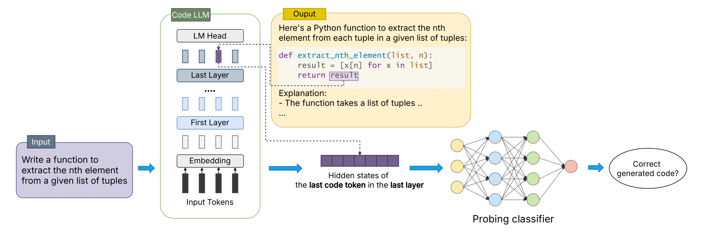

#### Paper: https://arxiv.org/abs/2501.12934

## The architecture



# Quickstart

## Prepare Environment
First, we should set up a python environment. This code base has been tested under python 3.10.

```bash
$ conda create -n openia python=3.10
$ conda activate openia
$ pip install -r requirements.txt
```

## Dataset files
Below we describe for each dataset what you need to do to run the scripts on it.

- **DevEval:** Requires `benchmark/DevEval/data/completion_dataset.jsonl` and `benchmark/DevEval/data/train_project_ids.txt`.
- **HumanEval:** Requires `benchmark/HumanEval/data/humaneval-python.jsonl`.
- **MBPP:** Requires `benchmark/MBPP/data/mbpp.jsonl`.

All these files and the related files for the executed tests are provided in this Git repository.

## Supported models

- `deepseek-ai/deepseek-coder-6.7b-instruct`
- `deepseek-ai/deepseek-coder-1.3b-instruct`
- `codellama/CodeLlama-7b-Instruct-hf`
- `ise-uiuc/Magicoder-S-DS-6.7B`

## Generating Model Answers and Saving Hidden States (Preliminary for All)

The first step is to generate answers for each dataset and save the hidden states of the generated tokens.

```bash
python3 -m pipeline.save_hidden_states --model [model name] --dataset [dataset name] --layers [list of layers]
```

Example:
```bash
    python3 -m pipeline.save_hidden_states --model deepseek-ai/deepseek-coder-6.7b-instruct --dataset human_eval --num_generations_per_prompt 10 max_num_gen_once 5 --layers 1 4 8 12 16 20 24 28 32 --max_new_tokens 400
```

> [!NOTE]
> For the model `deepseek-ai/deepseek-coder-1.3b-instruct`, you can extract hidden states from layers 0 to 24.
For other models, the available layer range is from 0 to 32.

## Extracting specific layer & token (section 2)

```bash
    python3 -m pipeline.extract_token_code --model [model name] --dataset [dataset name] --layers [list of layers] --generate_dir [generate dir]
```

Example:
```bash
    python3 -m pipeline.extract_token_code --model deepseek-ai/deepseek-coder-6.7b-instruct --dataset human_eval --layers 1 4 8 12 16 20 24 28 32 --generate_dir output/deepseek-ai_deepseek-coder-6.7b-instruct_human_eval_python_1_4_8_12_16_20_24_28_32/temp2
```

> [!NOTE]
> You can extract hidden states from layers you save in the previous step.

## Probing a specific layer & token (section 3)

Use `save_clf` flag to save the classifier. If running again, this flag indicates to load the trained classifier and only evaluate on the test set.
Saving the classifier is necessary for later use in the answer choice experiment.
```bash
    classifier.py --model [model] --model [model name] --dataset [dataset] --layer [layer] --token [token]
```

For example:
```bash
    classifier.py --model [model] --model [model name] --dataset [dataset] --layer [layer] --token [token]
```
## Other baselines


# Citation
If you're using RAMBO in your research or applications, please consider citing our paper:
```bibtex
@article{bui2025correctness,
  title={Correctness Assessment of Code Generated by Large Language Models Using Internal Representations},
  author={Bui, Tuan-Dung and Vu, Thanh Trong and Nguyen, Thu-Trang and Nguyen, Son and Vo, Hieu Dinh},
  journal={arXiv preprint arXiv:2501.12934},
  year={2025}
}
```

# Contact us
If you have any questions, comments or suggestions, please do not hesitate to contact us.
- Email: 21020006@vnu.edu.vn

# License
[MIT License](LICENSE)